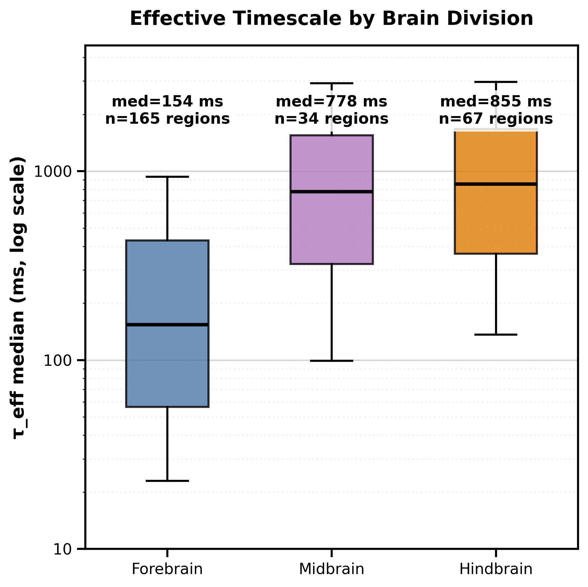
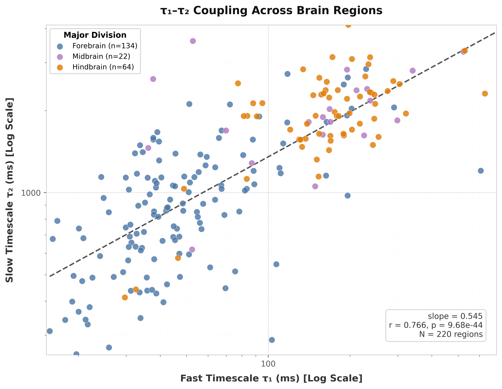

This reference paper is its own documentation: each paragraph and directive below demonstrates
something you can reuse. Delete this guidance and write your study. The usual micropublication
shape works well — a brief introduction, methods, results, and a short discussion.

## Introduction

Cite a work textually with `@key` (e.g. @lovelace1843) or parenthetically with brackets
(e.g. [@turing1936]). Group several keys with semicolons
[@lovelace1843; @turing1936; @hopper1952]. Abbreviations defined in the frontmatter, such as
ISP, are linked automatically the first time they appear.

(sec-methods)=
## Methods

Cross-reference figures, tables, equations, and sections with the **label-only** form
`[](#label)` — the renderer fills in "Figure 1", "Table 1", etc., and it stays correct in both
the web and PDF builds. Do not hardcode numbers or add display text like `[Figure 1](#...)`.

Numbered, cross-referenceable equations use a `{math}` block with a `:label:`:

```{math}
:label: eq-snr
\mathrm{SNR} = \frac{\mu_\text{signal}}{\sigma_\text{noise}}
```

Then refer to it as [](#eq-snr). Inline math uses single dollars, e.g. $\mathrm{SNR} > 5$. If
you need angle brackets in math, prefer the Unicode characters ⟨ ⟩ over `\langle`/`\rangle`,
which raise a Typst deprecation warning.

## Results

A figure can hold one image or several. There are two ways to build a multi-panel figure, and
the choice changes how you cross-reference the panels — both are shown below.

### Let MyST arrange the panels

Put each panel in its own `` inside a single `{figure}`. MyST numbers them as one figure
and adds the sub-labels — **A**, **B**, … — automatically, laying the panels side by side in
the PDF. Each panel also gets its own cross-reference: the whole figure is [](#fig-panels), and
the individual panels are [](#fig-panels-a) and [](#fig-panels-b) — you never type the letters
yourself, so they stay correct if you reorder the panels.

:::{figure}
:label: fig-panels
:alt: Effective timescales summarized across brain divisions, and the coupling between fast and slow timescales.





Panels composed by MyST. Write the shared caption here; the **A** and **B** labels are added
for you. The bracket text on each image is its alt text (and a per-panel caption on the web).
:::

### Or supply one composite image

If you arranged the panels yourself — in your plotting code or a vector editor — drop in the
single image and describe each panel in the caption. There are no sub-labels to reference here,
so append the panel letter as plain text right after the reference, e.g. [](#fig-composite)a. A
bare backslash on its own line forces a line break between panel descriptions.

```{figure} figures/figure2.png
:label: fig-composite
:width: 70%
:alt: Describe the figure here for screen readers and accessibility.

**(a)** Describe the first panel. Write one paragraph per panel.
\
**(b)** Reference figures, tables, and equations by label so numbering survives reordering.
\
**(c)** Tip: put a vector pair (`figure2.svg` + `figure2.pdf`) in `figures/` and reference
`figures/figure2.*` — the build picks SVG for the web and PDF for print. A single `.png` works
too.
```

Tables use a `{table}` directive with the caption as the directive argument and a `:label:`
for cross-references ([](#tbl-results)). Fold any footnotes into the caption rather than
placing them below the table:

```{table} Summary of results. Values are mean ± SD; p from a two-sided t-test.
:label: tbl-results
:align: center

| Condition | N | Score | p |
|---|---:|---:|---:|
| Control | 32 | 0.41 ± 0.08 | — |
| Treatment | 30 | 0.63 ± 0.09 | < 0.001 |
```

:::{note}
Use a note admonition for asides, caveats, or table footnotes — it renders as a callout box.
:::

## Discussion

Say what the result means and what it does not. Keep it short; this is a micropublication.

Additional analyses appear in the supplement ([](#supp-fig-1) and [](#supp-tbl-1)) — note that
cross-references work across files in the merged PDF.

<!--
No "## References" section: the template renders the bibliography automatically from the
`bibliography:` file declared in myst.yml.

Prefer a SEPARATE supplement (supplementary.md, already wired in myst.yml). To inline it
instead, delete supplementary.md and add, at the end of this file:

    ```{raw:typst}
    #set heading(numbering: none)
    ```

    # Supplementary material

    ...your supplementary figures/tables...

…and remove supplementary.md from the toc and the exports block in myst.yml.
-->
